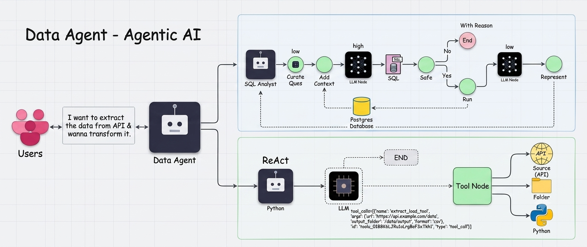

# 🚀 Data Agent

*Your intelligent companion for loading, exploring, and interacting with relational data.*

---

## 📖 Overview

The **Data Agent** is a Python‑powered ETL (Extract‑Transform‑Load) utility designed to bootstrap a PostgreSQL database with realistic sample data and lay the groundwork for AI‑driven data analysis.  It combines:

* Robust schema creation (users, vehicles, rides, payments, ratings)  
* High‑performance bulk loading via PostgreSQL `COPY`  
* A clean, extensible codebase ready for LangChain/LangGraph agents  
* Simple CLI entry‑point (`data-agent`) for developers and data enthusiasts  

Whether you’re prototyping a recommendation engine, practicing SQL queries, or experimenting with LLM‑to‑SQL agents, Data Agent gets you up and running in seconds.

## 🏗️ Architecture



1. **Configuration Layer** – Reads `.env` for database credentials and optional API keys.  
2. **ORM‑Lite Layer** – Uses `psycopg2` + `dotenv` for connection management.  
3. **Schema Engine** – Executes a single SQL block to create tables, indexes, and constraints.  
4. **CSV Loader** – Streams CSV files from the `data/` folder using `cursor.copy_expert` for maximal throughput.  
5. **Verification Module** – Prints row counts per table to confirm successful ingest.  
6. **Extension Hook** – The `main.py` entry‑point is wired to call the loader; future work can plug in LangGraph agents, APIs, or web UIs.


## 🤖 Agent Descriptions

### 1. **Data Agent (Main Router)**
**File:** `agents/data_agent.py`

**Responsibility:** 
- Receives natural language user queries
- Classifies queries as either SQL or ETL operations
- Routes queries to appropriate sub-agents
- Aggregates results and returns to user

**Components:**
- **Router Node**: Uses structured output to classify query intent
- **Conditional Routing**: Routes to SQL or ETL based on classification
- **Graph Orchestration**: Manages workflow using LangGraph

---

### 2. **SQL Analyst Agent**
**File:** `agents/sql_analyst.py`

**Responsibility:**
- Converts natural language queries to SQL
- Handles all database query operations
- Validates query safety
- Executes queries and returns results

**Workflow:**
1. **Query Curation** - Refines user question for clarity
2. **Context Gathering** - Fetches database schema details
3. **Prompt Construction** - Creates detailed context for LLM
4. **SQL Generation** - Generates SQL query using LLM
5. **Safety Check** - Validates query safety
6. **Query Execution** - Executes validated query on database
7. **Answer Generation** - Formats and returns results

**Safety Features:**
- Prevents execution of dangerous commands (INSERT, UPDATE, DELETE, DROP, ALTER)
- Validates query before execution
- Automatic result limiting to 10 rows (unless specified)
- Schema validation against database

---

### 3. **ETL Analyst Agent**
**File:** `agents/etl_analyst.py`

**Responsibility:**
- Handles data extraction from APIs
- Performs data transformation using Pandas
- Manages data loading to various formats
- Executes code safely in controlled environment

**Workflow:**
1. **Tool Binding** - Attaches ETL tools to LLM
2. **User Intent Understanding** - Analyzes transformation requirements
3. **Tool Selection** - Chooses appropriate ETL operation
4. **Code Generation** - Generates Pandas code for transformation
5. **Safe Execution** - Executes generated code in sandboxed environment
6. **Result Reporting** - Returns execution status and generated code

**Supported Tools:**
- **extract_load_tool**: Extract from API → Load to storage
- **transform_load_tool**: Transform data using Pandas → Load result

**Supported Formats:**
- CSV (default)
- JSON (Lines or Records)
- Parquet

---

## 📊 Data Models

### AgentSchema (SQL Agent State)
```python
class AgentSchema(BaseModel):
    messages: List                    # Conversation messages
    user_question: str                # Original user query
    curated_ques: str                 # Refined question
    prompt_query_context: str         # Database context + prompt
    generated_sql_query: str          # Generated SQL
    is_safe: Literal["Yes", "No"]     # Safety validation result
    comments: str                     # Safety check comments
    sql_query_execution_result: str   # Query result
    final_answer: str                 # Final formatted answer
```

### ETLAgentSchema (ETL Agent State)
```python
class ETLAgentSchema(BaseModel):
    messages: List                    # Conversation messages
```

### RouterSchema (Query Classification)
```python
class RouterSchema(BaseModel):
    answer: Literal["sql", "etl"]     # Query classification
    comments: str                     # Reasoning for classification
```

### DataAgentSchema (Main Agent State)
```python
class DataAgentSchema(BaseModel):
    messages: List                    # All conversation messages
    route_response: str               # Router decision (sql/etl)
```

---

## 🚀 Getting Started

### Prerequisites

* **Python ≥3.14** (as declared in `pyproject.toml`)  
* **PostgreSQL server** (version 12+ recommended) – accessible via host/port/user/password  
* **Git** (optional) – to clone the repository  
* **UV** (optional but recommended) – for fast, reproducible dependency management  

### 1️⃣ Clone the repo

```bash
git clone https://github.com/your-username/data-agent.git
cd data-agent
```

### 2️⃣ Set up a virtual environment (UV)

```bash
uv sync          # creates .venv and installs dependencies from pyproject.toml + uv.lock
source .venv/bin/activate   # on Windows: .venv\Scripts\activate
```

### 3️⃣ Configure environment

Copy the example file and fill in your PostgreSQL details:

```bash
cp .env.example .env
# Edit .env with your favorite editor
```

**.env** should contain at least:

```dotenv
host=localhost
port=5432
database=dataagent
user=your_pg_user
password=your_pg_password
# Optional – for future LLM integrations
GROQ_API_KEY=your_groq_key_here
```

### 4️⃣ Prepare the CSV data

Create a folder named `data` at the project root and place the following CSV files inside:

* `users.csv`
* `vehicles.csv`
* `rides.csv`
* `payments.csv`
* `ratings.csv`

*(The exact column names are defined in `feed_db.py`; see the source for details.)*

### 5️⃣ Run the ETL

#### Option A – Direct script execution

```bash
python feed_db.py
```

#### Option B – Installed console script (after `uv sync`)

```bash
data-agent
```

You should see output similar to:

```
Connected to PostgreSQL
Tables created successfully
Loaded users.csv
Loaded vehicles.csv
Loaded rides.csv
Loaded payments.csv
Loaded ratings.csv

Record counts:
users            10,000
vehicles          8,000
rides            50,000
payments         45,000
ratings          30,000

Data loaded successfully!
Transaction committed.
PostgreSQL connection closed.
```

## 🛠️ Project Structure

```
data-agent/
│
├─ .env                  # (local) DB credentials & API keys
├─ .env.example          # Template for .env
├─ .gitignore
├─ .python-version       # Locks Python ≥3.14
├─ DataAgent_Architecture.png   # High‑level architecture diagram
├─ feed_db.py            # Core ETL logic (schema + CSV load)
├─ main.py               # CLI entry‑point (currently delegates to feed_db)
├─ pyproject.toml        # Project metadata, dependencies, UV build config
├─ README.md             # You’re reading it!
├─ sql_analyst_graph.png # Diagram of the SQL analysis flow (optional)
├─ test_schema_details.txt # Human‑readable schema + sample rows (reference)
├─ uv.lock               # Dependency lock file for reproducible builds
└─ data/                 # ← Place your CSV files here (not versioned)
```

## 📦 Dependencies

| Package | Purpose |
|---------|---------|
| `dotenv` | Loads environment variables from `.env` |
| `psycopg2-binary` | PostgreSQL adapter |
| `langchain` | Base framework for LLM chains |
| `langchain-openai` | OpenAI (and compatible) LLM integrations |
| `langgraph` | Stateful graph‑based agents (future‑proof) |
| `pandas` | Flexible data structures (useful for analysis scripts) |
| `ipython` | Interactive Python shells / notebooks |
| `pydantic` | Data validation & settings management |

All are automatically installed via `uv sync` or `pip install -e .`.

## 🧪 Testing & Quality

* **Unit tests** – Add pytest suites that spin up a temporary PostgreSQL container (using `testcontainers` or Docker) and assert correct row counts.  
* **Linting** – Ruff or Flake8 can be added via `pyproject.toml` under `[tool.ruff]`.  
* **Type checking** – MyPy or Pyright for static analysis.  

*Feel free to contribute a `tests/` folder and CI workflow!*

## 🤝 Contributing

We welcome contributions! Please follow these steps:

1. Fork the repository.  
2. Create a feature branch (`git checkout -b feature/awesome-idea`).  
3. Make your changes, ensuring you respect the existing code style.  
4. Add or update tests as needed.  
5. Commit with a clear message (`git commit -m "Add …"`).  
6. Push to your fork and open a Pull Request.  

Please read the (forthcoming) `CONTRIBUTING.md` for detailed guidelines.

## 📄 License

This project is licensed under the **MIT License** – see the `LICENSE` file for details.

## 📬 Contact

* **Author:** Sanyam Jain  
* **Email:** sanyamjain2703@gmail.com  
* **GitHub:** https://github.com/sanyam03-hub  

If you have questions, suggestions, or just want to share what you built with Data Agent, drop us a line!

---

### 🎉 Happy Data‑Agenting!

*Let the data flow, and may your queries always return insight.'
